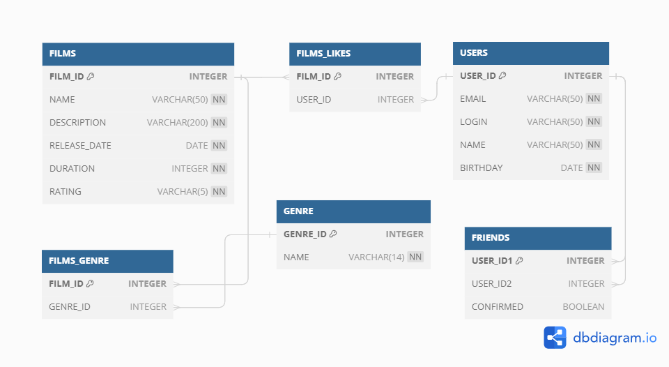

# java-filmorate
Template repository for Filmorate project.

Пояснение к диаграмме:
Таблица FILMS содержит все данные об объекте: уникальный идентификатор - primary key данной таблицы, 
название, описание, дату выхода, продолжительность,
а также поле рейтинг (формат String, все рейтинги будут перечислены в Enum).

Таблица GENRE содержит данные о жанрах: уникальный идентификатор - primary key данной таблицы, название жанра.
 
Таблица FILMS_GENRE отражает связь между двумя вышеописанными таблицами: связь "многие ко многим" - у одного фильма
может быть несколько жанров, у одного жанра - много фильмов.

Таблица USERS содержит все данные об объекте: уникальный идентификатор - primary key данной таблицы,
е-mail, логин, имя для отражения на сайте, дата рождения.

Таблица FILMS_LIKES отражает связь между таблицами USERS и FILMS: связь "многие ко многим" - 
один фильм может иметь много лайков разных пользователей, один пользователь может поставить 
много лайков разным фильмам.

Таблица FRIENDS отражает статус между двумя пользователями столбцом CONFIRMED: связь "многие ко многим" - 
один пользователь может быть другом другим многим пользователям, может отправить 
много запросов в друзья, пока не подтвердженных.